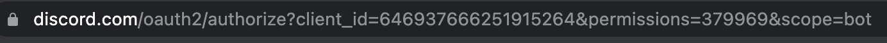
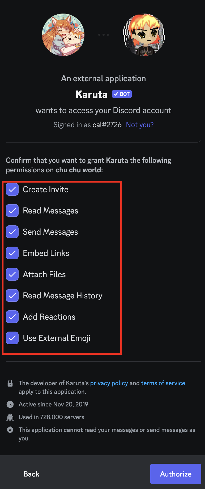

# Customizing a new Discord Server 

## Overview
In this section, we will focus on several different features to customize a discord server to improve the experience of server members. 

## Steps

1. Visit [<b>top.gg</b>](https://top.gg/) or any other discord bot website to view available public customized discord bots.

    

    <figure markdown>

    

    <figcaption>Image caption</figcaption>
    </figure>
     
  
    Browse for discord bots and the features that you want to add to your Discord server. 

2. Retrieve the discord URL of the bot to add to your server.
    
    

    For top.gg, you can simply click invite on the bot you want and it will direct you to the discord bot URL.

    

3. Enter the URL into your browser.

4. Select the server that you want to add the discord bot to. 

    

    You must have the **Manage Server** permission enabled in your server. This setting should be already enabled when creating a new server. 

5. Select the server permissions that the bot will have access to.  
  
Permissions must be enabled to allow for certain features that the bot will do.

    > Create Invite - Allow the bot to generate invites to your server
    >
    > Read Messages - Allow the bot to read messages in the server (Important for  commands) 
    >
    Send Message - Allow for the bot to respond to messages (Import for commands)
    >
    > Embed Links - Allow for the bot to send embedded links 
    >
    > Attach files - Allow for the bot to attach files to message responses
    >
    > Read message history - Allow for the bot to read previous messages in the server
    >
    > Add reactions - Allow the bot to utilize emoji reactions in the server
    >
    > Use External Image - Allow the bot to use external images
    >

6. Click the authorize to confirm your settings and to add the discord bot to your server.

    

    

## Conclusion
