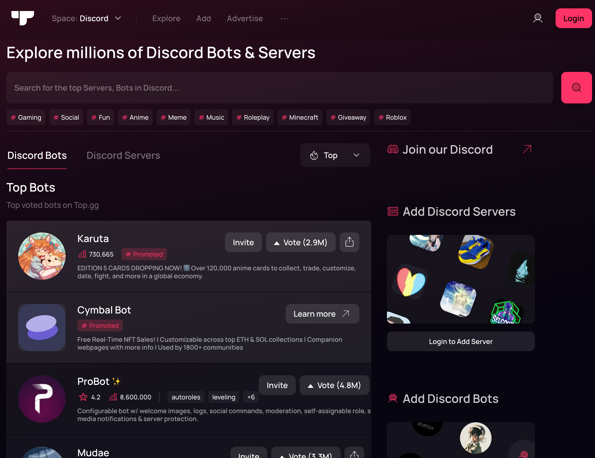
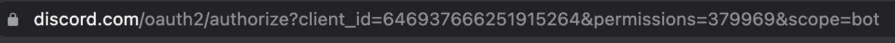
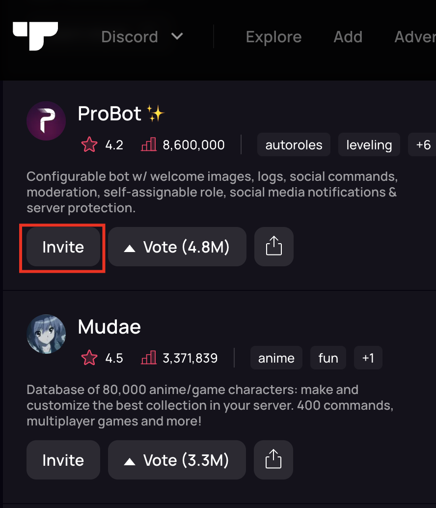
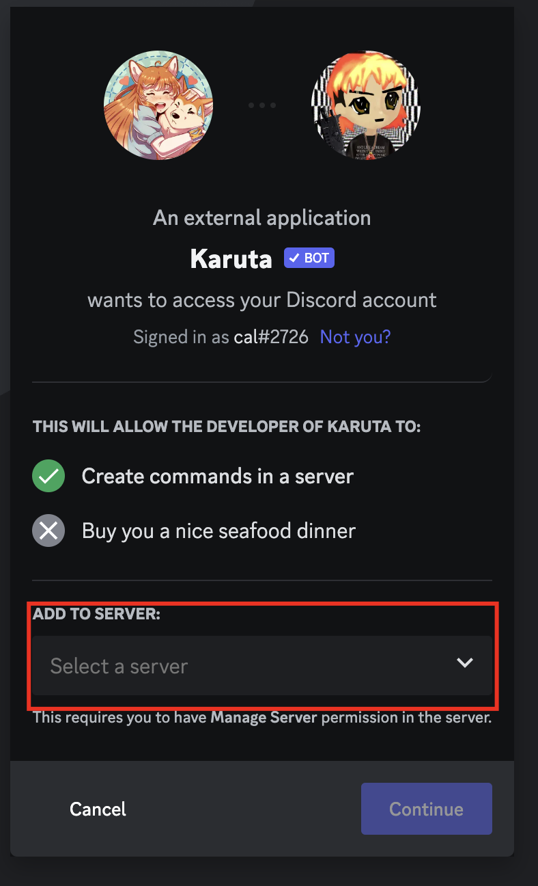
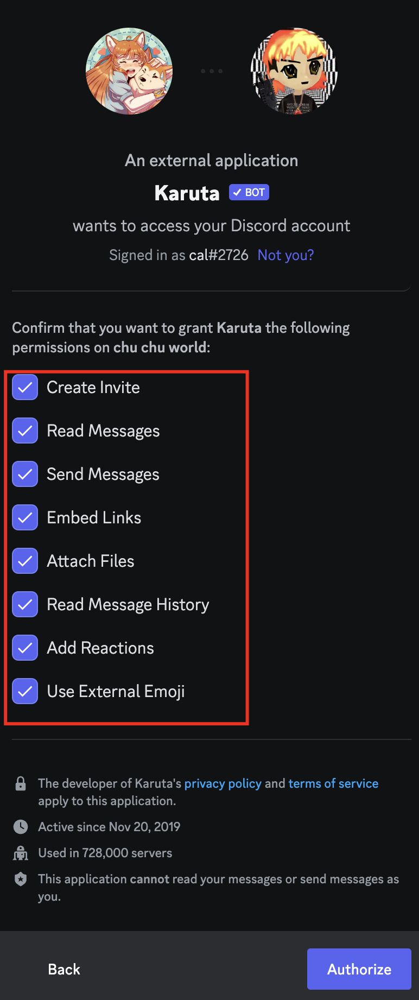
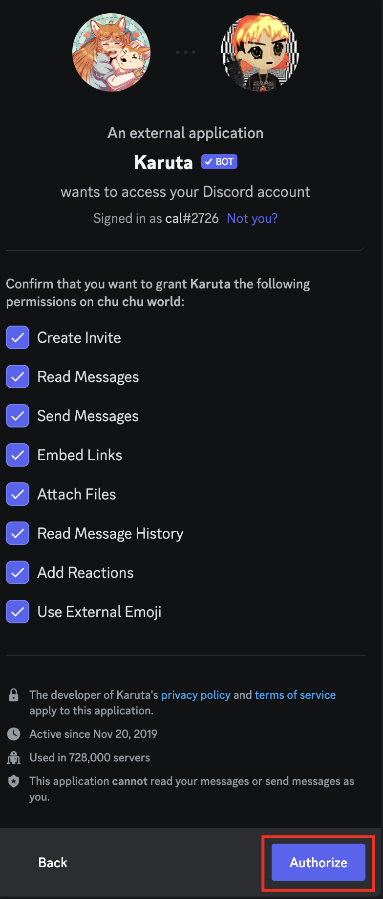

# Adding a Discord Bot to a Server

## Overview
In this section

## Adding a new discord bot

1. Visit [<b>top.gg</b>](https://top.gg/) or any other discord bot website to view available public customized discord bots.

     

    Browse for discord bots and the features that you want to add to your Discord server.

2. Retrieve the discord URL of the bot to add to your server.
    
    

    For top.gg, you can simply click invite on the bot you want and it will direct you to the discord bot URL.

    

3. Enter the URL into your browser.

4. Select the server that you want to add the discord bot to. 

    

    You must have the **Manage Server** permission enabled in your server. This setting should be already enabled when creating a new server. 

5. Select the server permissions that the bot will have access to.  

  
Permissions must be enabled to allow for certain features that the bot will do.

    > Create Invite - Allow the bot to generate invites to your server
    >
    > Read Messages - Allow the bot to read messages in the server (Important for  commands)
    >
    Send Message - Allow for the bot to respond to messages (Import for commands)
    >
    > Embed Links - Allow for the bot to send embedded links
    >
    > Attach files - Allow for the bot to attach files to message responses
    >
    > Read message history - Allow for the bot to read previous messages in the server
    >
    > Add reactions - Allow the bot to utilize emoji reactions in the server
    >
    > Use External Image - Allow the bot to use external images
    >

  
6. Click the authorize to confirm your settings and to add the discord bot to your server.

7. Await the authorized confirmation. Once it has appeared, you may close the browser/window. 

8. Confirm in your server that the discord bot has been added. 

9. Congratulations! You should now see the bot online in the list of server members on the right.

## Using Discord bot commands

1. Locate the bot's profile in the server list on the right.
2. Click on the bots name to view more information about the bot.
      
    The information presented may vary from bot:
    
    > About Me: Information about the 
    >
    > Member Since: Date since the bot was a member of your server
    >
    > Roles: The roles/permissions that are given to the bot
    >
3. View information regarding your bots commands.

    Discord bot commands are entered through the message input.

4. Type the desired command with the appropriate command prefix.

5. Press Enter

    The bot will provide the corresponding function and feedback to confirm the status of the command.

## Removing a bot from a Server

1. Locate the bot's profile in the server list on the right.
2. Right-click the bot to access options.
3. Select the "Kick <BOT NAME>" to remove the bot from the server.

## Conclusion